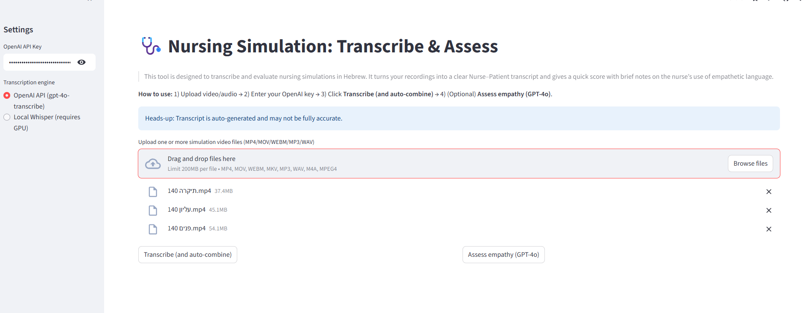
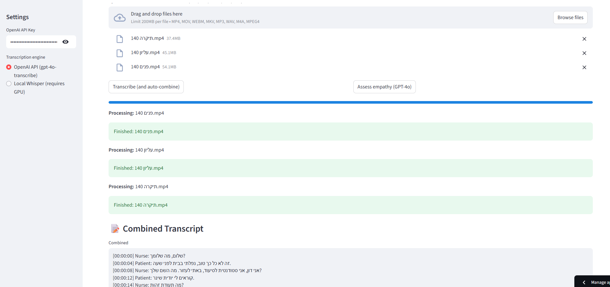
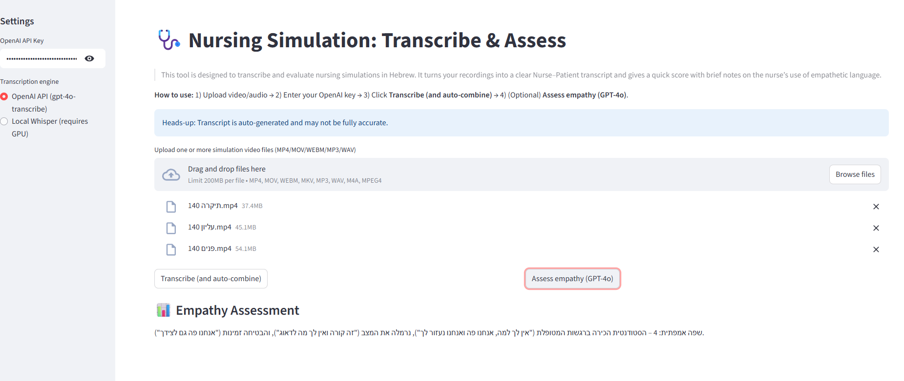

# Nursing Empathy Evaluation

This tool is designed to transcribe and evaluate nursing simulations in Hebrew. It turns your recording into a clear Nurse–Patient transcript and gives a quick score with brief notes on the nurse’s use of empathetic language.

> **Heads-up:** Transcripts are auto-generated and might miss or mangle a few words. Use clinical judgment and fix anything that looks off.

---

## Live app
```
https://nursing-empathy-evaluation-il.streamlit.app/
```

## How it works (quick guide)

1) **Upload** your simulation recording(s) — MP4/MOV/WEBM/MKV/MP3/WAV/M4A.  
2) **Enter your OpenAI key** in the left sidebar.  
3) Click **Transcribe (and auto-combine)**.  
   - The app turns each file into text and **merges everything** into one clean, time-ordered conversation with roles: **Nurse / Patient** (OOC if needed).  
4) Review the **Combined Transcript** (you can download it as `.txt`).  
5) (Optional) Click **Assess empathy (GPT-4o)** to get a **1–5 score** with a short reason focused on the nurse’s lines.

**What you get**
- A clear transcript for debriefs (no raw chunks shown).
- A quick empathy score on the nurse’s communication.

**Tips**
- Multiple uploads are fine — they’ll be stitched into one timeline.  
- Very long/quiet audio may be harder to transcribe; check the text and edit if needed.  
- Keep patient privacy in mind when sharing transcripts.


- **OpenAI API key** – required for:
  - **Combine**: merges all transcripts into a single, time-ordered Nurse/Patient conversation (uses **GPT-4o**).
  - **Empathy check**: 1–5 score with brief justification focused on the nurse’s lines (uses **GPT-4o**).

**How to create an API key (official guide):**  
See OpenAI’s step-by-step “Create and export an API key” instructions.  
https://platform.openai.com/docs/quickstart/create-and-export-an-api-key


## Features
-  **Speech-to-text:** Uses OpenAI **gpt-4o-transcribe** to convert video/audio to text,optional local Whisper model usage if gpu is available.
- **Smart merge:** Combines multiple uploads into a single, timestamped, role-tagged transcript (`Nurse`, `Patient`, with `(OOC)` when needed).
- **Empathy score:** One-line 1–5 score + short justification (Hebrew template) using **GPT-4o**.
- **Export:** Download the combined transcript as `.txt`.

---

## Screenshots

> End-to-end flow: upload → transcribe & auto-combine → empathy score.

### 1) Upload & Setup
*After adding your OpenAI API key and the video files.*



### 2) Transcribe & Auto-combine
*The app processes each file and shows the merged Nurse–Patient transcript.*



### 3) Empathy Assessment
*Click **Assess empathy (GPT-4o)** to get a 1–5 score with a short notes.*




## Quick start (local)

1. **Python 3.10** and **ffmpeg** (see FFmpeg below).
2. Install deps:
   ```bash
   pip install -r requirements.txt
   ```
3. Run:
   ```bash
   streamlit run app.py
   ```
4. In the app: upload `.mp4/.mov/.webm/.mkv/.mp3/.wav/.m4a`, click **Transcribe (and auto-combine)**, then **Assess empathy (GPT-4o)** if you want the score.


---

## Configuration

- **Models (fixed by this app):**
  - Speech-to-text: `gpt-4o-transcribe`
  - Text (merge + empathy): `gpt-4o`

---

## Requirements

Put this in `requirements.txt`:

```txt
streamlit>=1.36
openai>=1.40.0
pydub>=0.25.1
openai-whisper
Levenshtein
```

> Optional local path (only if you want Whisper on your own machine):
> ```txt
> git+https://github.com/openai/whisper.git
> torch
> ```

---

## FFmpeg

- **Cloud:** no action needed.
- **Local:** install ffmpeg if missing.
  - **Windows:** download static build from https://www.gyan.dev/ffmpeg/builds/ → extract → add `.../bin` to PATH → `ffmpeg -version`
  - **macOS:** `brew install ffmpeg`
  - **Ubuntu/Debian:** `sudo apt-get update && sudo apt-get install -y ffmpeg`

---

## Project structure

```
Project structure
.
├─ README.md
├─ app.py              # Streamlit UI (auto-combine + empathy)
├─ gpt_utils.py        # OpenAI helpers/templates
├─ pipeline.py         # helper fucntion
├─ requirements.txt    # Python deps
├─ packages.txt        # System packages for deploy (e.g., ffmpeg)
├─ runtime.txt         # Python version pin for hosting
├─ screenshots/        # Images used in README
├─ graphs/             # Diagrams/figures referenced in paper
├─ code/               # Extra scripts/notebooks
├─ data/               # video,prompts,and transcripts
├─ .devcontainer/      # VS Code dev container config
└─ .gitignore

```


